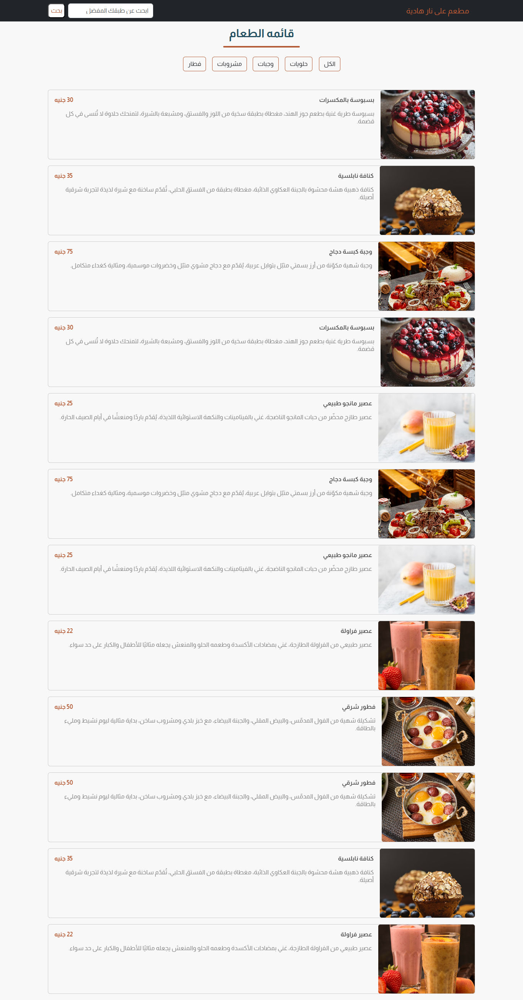

# 🍽️ Ala Nar Hadiya - Restaurant Web App

A simple and elegant restaurant web application built with React and React-Bootstrap. Users can browse menu items, filter by category, or search by name.

---

## 📸 Preview



---

## 🛠️ Tech Stack

- React
- React-Bootstrap
- JavaScript (ES6)
- CSS

---

## 📦 Installation & Usage

1. **Clone the repository:**

```bash
git clone https://github.com/your-username/restaurant-app.git
```

2. **Navigate to the project folder:**

```bash
cd restaurant-app
```

3. **Install dependencies:**

```bash
npm install
```

4. **Run the app locally:**

```bash
npm start
```

The app will start on `http://localhost:3000`.

---

## 📁 Folder Structure

```
src/
├── components/
│   ├── NavBar.jsx
│   ├── Header.jsx
│   ├── Category.jsx
│   └── ItemsList.jsx
├── data.js
├── App.js
└── index.js
```

---

## ✨ Features

- Browse menu items with name, image, price, and description.
- Filter by category (e.g., Breakfast, Meals, Desserts, Drinks).
- Search for items by name.
- Responsive design using React-Bootstrap.

---

## 💡 Future Improvements

- Add shopping cart functionality.
- Add product detail page.
- Implement user authentication.
- Build an admin dashboard for content management.

---
